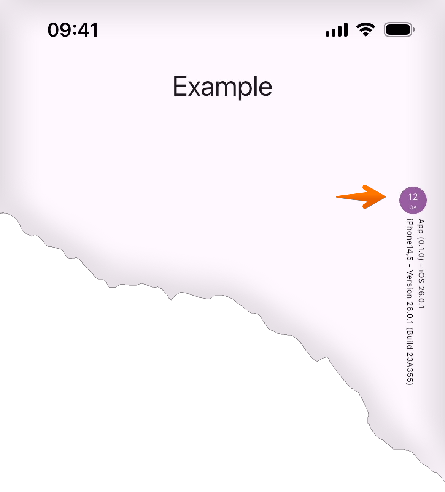
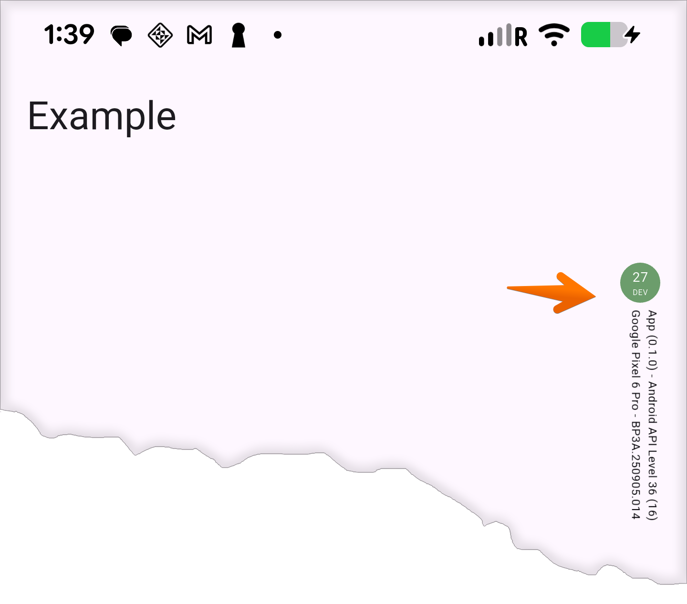

# Environment Indicator for Flutter

A simple Flutter widget that displays environment information (DEV/QA/PROD) and
device details in your app. This indicator is only visible in non-production
environments.

## Screenshots

_iOS: QA Environment, with build #12, OS version 26.0.1, app version 0.1.0, and device iPhone 13 (iPhone14,5), Build 23A355_ 


_Android: DEV Environment, with build #27, OS version 11, app version 0.1.0, and device Google Pixel 6 Pro, API Level 36 (16)_


## Features

- Environment indicator dot with customizable colors
- Shows build number and environment name
- Displays app version, OS version, and device details
- Auto-hides in production environment
- Positioned overlay that doesn't interfere with app UI
- Support for both Android and iOS platforms
- Can be used with [flutter_dotenv](https://pub.dev/packages/flutter_dotenv) to load environment settings from a file, but not required

## Getting Started

### .env file for example
```ini
## For DEV environment
#ENV_NAME=DEV
#ENV_DOT_COLOR=055E05
#ENV_TEXT_COLOR=030206

## For QA environment
ENV_NAME=QA
ENV_DOT_COLOR=53015F
ENV_TEXT_COLOR=010101
```


Add this package to your Flutter project's dependencies:

## Usage

Import the package:
```bash
flutter pub add env_indicator
```

```dart
import 'package:flutter/material.dart';
import 'package:flutter_dotenv/flutter_dotenv.dart';
import 'package:env_indicator/env_indicator.dart';

/// declare AppInfo instance
late AppInfo appInfo;

Future<void> main() async {

  /// load DEV environment settings from a file
  await dotenv.load(fileName: '.env');
  final String? env = dotenv.env['ENV_NAME']; // ex: 'DEV', 'QA', or 'PROD'
  final String? dotColor = dotenv.env['ENV_DOT_COLOR']; // RGB hex value ex: '115E12'
  final String? textColor = dotenv.env['ENV_TEXT_COLOR']; // RGB hex value ex: '050506'

  /// initialize AppInfo instance
  appInfo = AppInfo();
  await appInfo.init(env, dotColor: dotColor, textColor: textColor);
  
  runApp(const MyApp());
}

class MyApp extends StatelessWidget {
  const MyApp({super.key});

  @override
  Widget build(BuildContext context) {
    return MaterialApp(
      debugShowCheckedModeBanner: false,
      home: Scaffold(
        appBar: AppBar(title: const Text('Example')),
        body: Stack(
          children: [
            Center(
              child: Column(
                mainAxisSize: MainAxisSize.min,
                children: const [
                  Text('Relax!', style: TextStyle(fontSize: 36.0)),
                  Text('And, check your app detail.', style: TextStyle(fontSize: 18.0)),
                ],
              ),
            ),
            /// Environment Indicator rendered here
            EnvIndicator(appInfo: appInfo), 
          ],
        ),
      ),
    );
  }
}

```