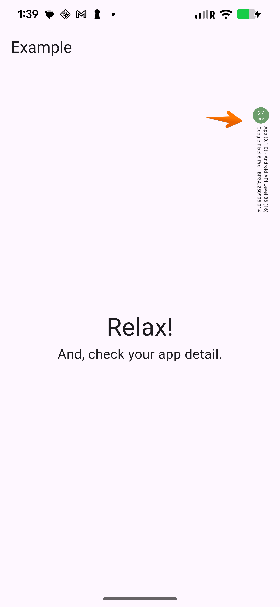
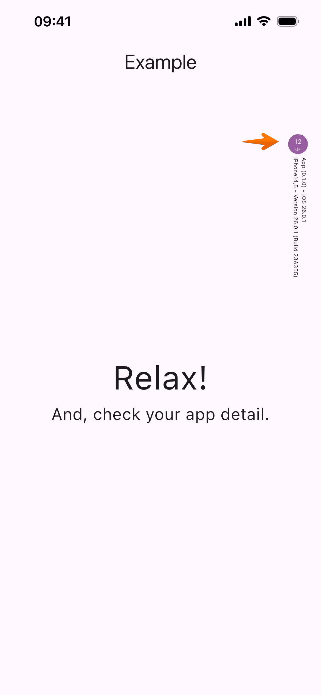

# Environment Indicator for Flutter

A simple Flutter widget that displays environment information (DEV/QA/PROD) and
device details in your app. This indicator is only visible in non-production
environments.

## Screenshots

* _Android: DEV Environment, with build #27, OS version 11, app version 0.1.0, and device Google Pixel 6 Pro, API Level 36 (16)_
  

* _iOS: QA Environment, with build #12, OS version 26.0.1, app version 0.1.0, and device iPhone 13 (iPhone14,5), Build 23A355_



### Features

- Environment indicator dot with customizable colors
- Shows build number and environment name
- Displays app version, OS version, and device details
- Auto-hides in production environment
- Positioned overlay that doesn't interfere with app UI
- Support for both Android and iOS platforms
- Can be used with [flutter_dotenv](https://pub.dev/packages/flutter_dotenv) to load environment settings from a file, but not required

### Usage

Add this package to your Flutter project's dependencies:

Import the package:
```bash
flutter pub add env_indicator
```

Add the widget to your app:
```dart
import 'package:flutter/material.dart';
import 'package:flutter_dotenv/flutter_dotenv.dart';
import 'package:env_indicator/env_indicator.dart';

/// Declare AppInfo instance
late AppInfo appInfo;

Future<void> main() async {
  
  /// initialize AppInfo instance
  appInfo = AppInfo();
  await appInfo.init(
      env: 'DEV',          /// environment name (i.e., 'DEV', 'QA', 'PROD')
      dotColor: '284B29',  /// color of the dot (RGB hex value)
      textColor: '030206', /// color of the text (RGB hex value)
      height: '120',       /// top position of the label
  );
  
  runApp(const MyApp());
}

class MyApp extends StatelessWidget {
  const MyApp({super.key});

  @override
  Widget build(BuildContext context) {
    return MaterialApp(
      debugShowCheckedModeBanner: false,
      home: Scaffold(
        appBar: AppBar(title: const Text('Example')),
        body: Stack(
          children: [
            Center(
              child: Column(
                mainAxisSize: MainAxisSize.min,
                children: const [
                  Text('Relax!', style: TextStyle(fontSize: 36.0)),
                  Text('And, check your app detail.', style: TextStyle(fontSize: 18.0)),
                ],
              ),
            ),
            
            /// Locate EnvIndicator 
            EnvIndicator(appInfo: appInfo),
          ],
        ),
      ),
    );
  }
}
```

### Load environment settings from a file

Additionally, [flutter_dotenv](https://pub.dev/packages/flutter_dotenv) package can be used to load environment settings from a file instead of hard-coding them.

* .DEV.env
```bash
## For DEV environment
ENV_NAME=DEV
ENV_DOT_COLOR=284B29
ENV_TEXT_COLOR=030206
ENV_LABEL_HEIGHT=90
```
* .QA.env
```bash
## For QA environment
ENV_NAME=QA
ENV_DOT_COLOR=53015F
ENV_TEXT_COLOR=010101
ENV_LABEL_HEIGHT=90
```

* pubspec.yaml

```yaml
dependencies:
  flutter_dotenv:
  env_indicator:

flutter:
  
  ## ...
  
  assets:
    - .env
    - .DEV.env
    - .QA.env
```


* main.dart
```dart
Future<void> main() async {

  /// Load environment settings from .env file
  await dotenv.load(fileName: '.DEV.env'); // or .QA.env, otherwise PROD
  final String env = dotenv.env['ENV_NAME'] ?? 'PROD';
  final String? dotColor = dotenv.env['ENV_DOT_COLOR'];
  final String? textColor = dotenv.env['ENV_TEXT_COLOR'];
  final String? height = dotenv.env['ENV_LABEL_HEIGHT'];

  /// Initialize the AppInfo
  appInfo = AppInfo();
  await appInfo.init(
      env: env, 
      dotColor: dotColor, 
      textColor: textColor, 
      height: height
  );

  runApp(const MyApp());
}

// ... other code 

```